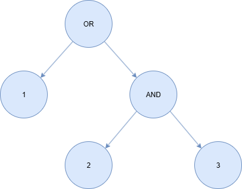
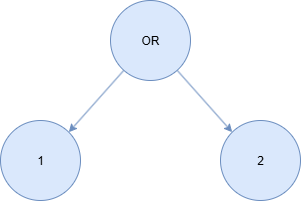

# simple ABE
We propose a method for building your own ABE model. The method considers policy operators OR and AND. Further development is planned. First we will attempt to develop more policy operators. We will probably try to develope fully abstract ABE model -- a model in which the operators are defined but no exact politics. For example the model will consider All combination of OR and AND based policies.

We use definition from this survey: https://www.oaepublish.com/articles/jsss.2023.30.

## Short dictionary
### parties
* __DO__ - data owner - party who encrypts data;
* __DU__ - data user - party who decrypt data;
* __TA__ - trusted athority - party who generates keys.
### types of ABE
We consider KP-ABE and CP-ABE. An ABE taxonomy can be more precise and complex, as in aforemantioned survey. Nevertheles, this work is a first step, so wee keep it simple.

* __KP-ABE__ - Generally The acces policy is encoded into the secret keys of the ciphertexts are created using a set of attributes. A ciphertext can only successfully be decrypted by a user if the attributes of the encrypted data fulfill the access policy embedded into the user's secret key.
* __CP-ABE__ - In contrast to KP-ABE schemes, in CP-ABE, the secret keys of users are associated with a set of attributes instead of an access policy. The access policty is encoded into cyphertext.

## CP-ABE Model description
Given attributes 1, 2, and 3, we specify an example policy in the following diagrams.

 

### functions and equations
## functions
* __att__ - creates attribute from ltk. (yes we generate first fresh ltk then attribute);
* __sk1__ - generates secret key using one ltk;
* __sk2__ - generates secret key using two ltk;
* __aenc_abe_1__ - encryption for first policy (3 atribute policy);
* __adec_abe_1__ - decryption for first policy (3 atribute policy);
* __aenc_abe_2__ - encryption for second policy(2 atribute policy);
* __adec_abe_2__ - decryption for second policy(2 atribute policy). 

## equations

### operators OR and AND
We model operators OR and AND in our model. operator att1 AND att2 means that party needs key associatet with both att1 and att2 attributes. att1 OR att2 means that party needs key associatet with one of these attributes. 

To build proper equations, one can firstly draw policy diagram. For instance lets have a look at first diagram in this file. It might be described as 1 OR (2 AND 3). then we might say: 

* key associated with att1 is enough to decrypt message.
* key associated with att2 and att3 is enough to decrypt message.

But what if somebody has key asssociated with att1 and att2. This key is also relevant.

How to model that? We need to look for keys associated with a minimal set of attributes requiered to decrypt a message, encrypted with a policy. Those two points above represent such a set. We know that keys might be associated with different number of attributes (look at sk1 and sk2). For simplicity in our example we consider keys associated with maximum two attributes. Additionally functions takes list (not set) of attributes, so we always use attributes in the same order: 1,2,3.

one defined:
1. the minial set of attributes;
2. maximum amount of attributes associated with key - (later we will call it key length);
3. order of attributes;
is ready to construct equations. Each set is analised according to all possible key lenght.
given minimal set of n attributes and maximum key length m we construct equations as shown below:

* $dec(enc(m), att(ltk_1), att(ltk_2), \dots, att(ltk_m), sk_1(ltk_1))$
* $dec(enc(m), att(ltk_1), att(ltk_2), \dots, att(ltk_m), sk_2(ltk_1, ltk_2))$
* $dec(enc(m), att(ltk_1), att(ltk_2), \dots, att(ltk_m), sk_n(ltk_1, ltk_2, \dots, ltk_n))$
* $dec(enc(m), att(ltk_1), att(ltk_2), \dots, att(ltk_m), sk_{n+1}(ltk_1, ltk_2, \dots, ltk_n, x))$
* $dec(enc(m), att(ltk_1), att(ltk_2), \dots, att(ltk_m), sk_{n+2}(ltk_1, ltk_2, \dots, ltk_n, x, x))$
* $dec(enc(m), att(ltk_1), att(ltk_2), \dots, att(ltk_m), sk_{m}(ltk_1, ltk_2, \dots, ltk_n, \underbrace{ x, \dots, x}_{m-n}))$

Note that x stands for any value, as these values are irrelevant for decryption but mandatory in the equations to ensure that every key length case is considered.

## rules 
### key_gen
key generation is done once. Firstly we generate ltk for each attribute and parties *Lxy* for each possible key of lenght 2. then for each ltk we create an attribute. Next We create all possible keys of lenght 2, with functions *sk1(x)* and *sk2(x,y)*. At the end we produce facts with keys, facts with attributes, publish attributes and parties. Note that Actions facts covers all parties, to be able to track them.  

### encrypt_P1
encrypt message with policy 1. Premise require list of attributes and Fresh message. cyphertext is evaluated with: *c = aenc_abe_1(~m,att1,att2,att3)*. There is only one conclusion - send cyperhtext.

### encrypt_P2
This rule is almost the same as previouse one. It evaluates cyphertext slightly different: *c = aenc_abe_2(~m,att1,att2)*

### Decryption - Policy_1
decrypt message with policy 1. Premise require cyphertext in input and Fact with key. Decryption is simple, just use relevant function with key from premise: *m = adec_abe_1(c,ltk)*

### Decryption - Policy_2
This rule is almost the same as previous one. It evaluates message using function relevant to second policy.

### Reveal
We define secrecy as in Tamarin book is defined secrecy for symmetric and asymmetric encryption. If key is not reveled then adversary do not know encrypted message. For this reason we added rule that reveals key.

### lemmas 
* __P1_all_dec_ex__ - covers proper decryption for policy 1, with all possible proper key of lenght 2.
* __P2_all_dec_ex__ - covers proper decryption for policy 2, with all possible proper key of lenght 2. 
* __secrecy__ - prove that secrecy holds If any key is not reveled.